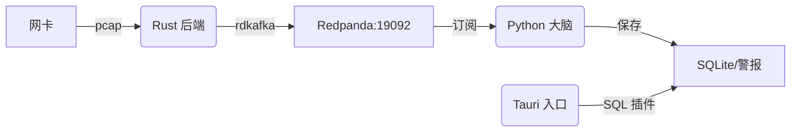

# Vesper-Insight

[English Version](./README_en.md) | **中文说明**

Vesper-Insight 是一款高性能全栈流量分析套件：Rust 采集 | Python AI 检测 | Tauri v2 可视化。支持自动化审计与深度预警。

## 🎯 核心特性

- **极速采集**: Rust + `pcap` 原生包捕获
- **流式 AI**: 基于 `river` 的在线异常检测（无需预训练）
- **轻量桌面**: Tauri v2 + React 实时可视化
- **解耦管道**: Redpanda (Kafka 兼容) 实时流量分发

## 📁 源码结构

```text
.
├── src/                # Rust 高性能数据采集后端 (Ingestion)
├── src/brain/          # Python AI 引擎 & 异常检测逻辑
│   ├── main.py         # 流处理主入口
│   └── model.py        # 基于 River/Torch 的模型定义
├── src/portal/         # Tauri v2 可视化前端 (Vite + React)
├── bruno/              # API 测试套件
└── Taskfile.yml        # 统一运维入口 (Source of Truth)
```

## 🛠️ 环境准备

在使用本项目前，请确保系统中已安装以下工具：

- **Go-Task**: `sudo snap install task --classic` 或按照官方文档安装。
- **Rust/Cargo**: 2024 Edition。
- **UV**: Python 依赖管理工具。
- **PNPM**: 前端包管理工具（Corepack 已默认集成）。

## 快速启动

### 1. 环境初始化

从头开始配置环境：

```bash
task init-py  # 初始化 Python 虚拟环境并安装核心依赖
task sync     # 对齐系统环境配置
```

### 2. 基础设施审计

确保所有后台服务（如 Redpanda）已就绪：

```bash
task check
```

### 3. 命令快查

| 命令           | 描述                                      |
| :------------- | :---------------------------------------- |
| `task dev`     | **一键启动**所有服务 (采集 + 大脑 + 前端) |
| `task init-py` | 初始化 Python 虚拟环境与依赖              |
| `task sync`    | 同步并检查系统环境配置                    |
| `task check`   | 审计基础设施 (Redpanda) 状态              |
| `task run-api` | 启动供测试用的 REST API 服务器            |

#### 一键启动

```bash
task dev  # 一键启动所有服务
```

_注：AI 分析结果会实时同步流式打印在终端屏幕上。_

#### 分组件运行

建议按以下顺序启动组件：

1.  **启动数据采集**

    ```bash
    task run-ingestion
    ```

    _注：脚本会自动请求 `sudo` 以执行 `setcap`，确保网卡原始包捕获权限。_

2.  **启动 AI 分析引擎**

    ```bash
    task run-brain
    ```

3.  **启动可视化前端**
    ```bash
    task run-portal
    ```

#### API 测试

1.  **启动 API 服务器**
    ```bash
    task run-api
    ```
2.  **使用 Bruno 调试**
    - 打开 [Bruno](https://www.usebruno.com/)。
    - 导入 `bruno/` 目录中的集合。
    - 默认端点：`http://127.0.0.1:8888`。

    > [!IMPORTANT]
    > **请务必查看弹出的桌面应用窗口**：本项目依赖 Tauri 原生 SQL 插件读取数据。虽然 Vite 会启动一个浏览器预览地址（localhost:5173），但由于浏览器安全沙箱限制，它无法读取本地数据库，数据会显示为 0。只有在**桌面窗口**中才能看到实时异常分析（**终端控制台亦有同步输出**）。

## 数据流向



## 开发与维护

- **环境自愈**: 报错时尝试运行 `task sync`。
- **Python 依赖**: 使用 `uv add <package>` 在 `src/brain` 目录下管理。
- **显存保护**: 默认限制 4GB/60% 显存占用以适配 RTX 3060 6GB。
- **感知阈值**: AI 模型存在 50 条数据的**预热期**。在此期间，控制台会显示 `WARMING` 且不会向数据库写入异常。
- **Rust 审计**: 在提交代码前运行 `task build-rust` 进行快速静态检查。

## 📓 注意事项

- **显存设置**: 默认在 `src/brain/.env` 中限制了显存占用。如遇显存不足，请确认没有其他进程（如浏览器硬件加速）干扰。
- **预热机制**: 模型在处理前 50 条流数据时处于 `WARMING` 阶段，此时不会产生警报。
- **文件路径**: 数据库位于 `src/brain/alerts.db`，由 Tauri 的 SQL 插件直接挂载，请勿手动移动。

## 🏗️ 生产构建

若需部署生产环境，请执行以下命令：

```bash
cargo build --release  # 构建优化后的 Rust 后端
pnpm run tauri build  # 构建生产级桌面安装包
```

---

Built with ❤️ by Antigravity.
