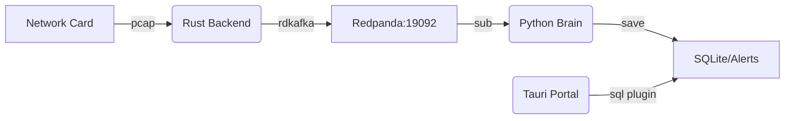

# Vesper-Insight

**English Version** | [中文说明](./README.md)

Vesper-Insight is a high-performance full-stack traffic analysis suite: Rust Ingestion | Python AI Detection | Tauri v2 Visualization. Supports automated auditing and deep alerting.

## 🎯 Key Features

- **Blazing Capture**: Rust + `pcap` native ingestion
- **Streaming AI**: Online anomaly detection via `river` (No pre-training)
- **Lightweight UI**: Real-time visualization with Tauri v2 + React
- **Decoupled Pipeline**: Redpanda (Kafka compatible) event distribution

## 📁 Project Structure

```text
.
├── src/                # Rust high-performance ingestion backend
├── src/brain/          # Python AI engine & anomaly detection logic
│   ├── main.py         # Stream processing entry point
│   └── model.py        # Model definition (River/Torch)
├── src/portal/         # Tauri v2 visualization frontend (Vite + React)
├── bruno/              # API testing suite
└── Taskfile.yml        # Unified operations entry (Source of Truth)
```

## 🛠️ Prerequisites

Before using this project, ensure the following tools are installed on your system:

- **Go-Task**: `sudo snap install task --classic` or install according to official documentation.
- **Rust/Cargo**: 2024 Edition.
- **UV**: Python dependency management tool.
- **PNPM**: Frontend package manager (Corepack recommended).

## Quick Start

### 1. Environment Initialization

Configure the environment from scratch:

```bash
task init-py  # Initialize Python virtual environment and install core dependencies
task sync     # Align system environment configuration
```

### 2. Infrastructure Audit

Ensure all background services (e.g., Redpanda) are ready:

```bash
task check
```

### 3. Task Reference

| Command        | Description                                         |
| :------------- | :-------------------------------------------------- |
| `task dev`     | **Start all** services (Ingestion + Brain + Portal) |
| `task init-py` | Initialize Python venv and dependencies             |
| `task sync`    | Sync and align system environment                   |
| `task check`   | Audit infrastructure (Redpanda) status              |
| `task run-api` | Start REST API server for testing                   |

#### All-in-one

```bash
task dev  # Start all services with one command
```

_Note: AI analysis results will be streamed in real-time to the terminal screen._

#### Manual Run

It is recommended to start the components in the following order:

1.  **Start Data Ingestion**

    ```bash
    task run-ingestion
    ```

    _Note: The script will automatically request `sudo` to execute `setcap`, ensuring raw packet capture permissions for the network card._

2.  **Start AI Analysis Engine**

    ```bash
    task run-brain
    ```

3.  **Start Visualization Frontend**
    ```bash
    task run-portal
    ```

#### API Testing

1.  **Start API Server**
    ```bash
    task run-api
    ```
2.  **Debug with Bruno**
    - Open [Bruno](https://www.usebruno.com/).
    - Import the collection in the `bruno/` directory.
    - Default endpoint: `http://127.0.0.1:8888`.

    > [!IMPORTANT]
    > **Be sure to check the desktop application window**: This project relies on the Tauri native SQL plugin to read data. While Vite will start a browser preview at `localhost:5173`, it cannot read the local database due to browser security sandbox restrictions, and data will show as 0. Real-time anomaly analysis can only be seen in the **desktop window** (simultaneous output is also available in the terminal console).

## Data Flow



## Development and Maintenance

- **Self-healing Environment**: Try running `task sync` if errors occur.
- **Python Dependencies**: Manage in the `src/brain` directory using `uv add <package>`.
- **VRAM Protection**: Default limit of 4GB/60% VRAM usage to suit RTX 3060 6GB.
- **Warmup Phase**: The AI model has a **warmup period** of 50 data points. During this time, the console will display `WARMING` and anomalies will not be written to the database.
- **Rust Audit**: Run `task build-rust` for a quick static check before submitting code.

## 📓 Important Notes

- **VRAM Configuration**: VRAM usage is restricted by default in `src/brain/.env`. If you encounter OOM, ensure no other processes (e.g., browser hardware acceleration) are interfering.
- **Warmup Mechanism**: The model is in a `WARMING` phase during the first 50 flow data points; no alerts will be generated during this time.
- **Database Path**: The database is located at `src/brain/alerts.db`, mounted directly by Tauri's SQL plugin. Do not move it manually.

## 🏗️ Production Build

To deploy in a production environment, run:

```bash
cargo build --release   # Build optimized Rust backend
pnpm run tauri build    # Build production desktop installer
```

---

Built with ❤️ by Antigravity.
